# 22 Best Dropshipping Suppliers Platforms in 2025

Finding reliable dropshipping suppliers who actually ship on time with decent product quality shouldn't feel like hunting for unicorns. Whether you're launching your first Shopify store selling trending fashion, testing print-on-demand products to build a custom brand, or scaling an existing operation that needs faster shipping than the typical 20-day AliExpress wait, the right dropshipping platform connects you to suppliers who won't leave your customers waiting forever while your refund requests pile up.

The dropshipping supplier landscape has evolved way beyond just sourcing from China and hoping products arrive intact. Modern platforms now offer curated US and EU suppliers with 2-5 day shipping, automated inventory syncing that prevents selling out-of-stock items, branded packaging maintaining your store's identity, and quality control actually worth trusting. Smart dropshippers now diversify across multiple supplier networks—mixing fast US fulfillment for premium products with affordable international options for budget items, all while automation handles the tedious order routing.

## **[Spocket](https://spocket.co)**

US and EU focused dropshipping platform connecting stores to quality suppliers with 2-5 day shipping and automated order fulfillment.

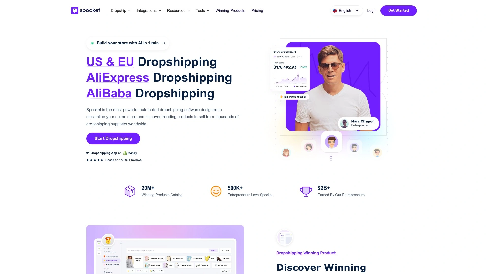

Spocket built its reputation by solving dropshipping's biggest pain point—slow shipping from overseas suppliers killing conversion rates and generating refund requests. Around 80% of Spocket's supplier network operates from the United States and Europe, delivering products to customers in 2-5 business days instead of the 15-30 day waits typical of Asian suppliers. This speed dramatically improves customer satisfaction and reduces the support headaches that come with delayed shipments.

The platform integrates seamlessly with Shopify, WooCommerce, BigCommerce, and Wix through native apps that sync products, inventory levels, and orders automatically. When customers purchase from your store, orders route to Spocket suppliers who fulfill and ship directly without you touching inventory or visiting post offices. Real-time inventory updates prevent the nightmare scenario of selling products that went out of stock hours ago.

Product quality trends higher than typical AliExpress items since Spocket vets suppliers and focuses on US/EU manufacturers. The ability to order samples with a few clicks lets you verify product quality before listing items in your store. Branded invoicing enables customization with your logo and branding, maintaining a cohesive customer experience rather than packages arriving with generic packing slips or worse, competitor branding.

Pricing starts at $39.99 monthly for the Starter plan, climbing to $299 for Enterprise accounts handling high volumes. A 14-day free trial lets you browse the full catalog and test the interface before committing. The higher pricing compared to purely China-sourced competitors reflects the premium placement of domestic suppliers and faster fulfillment. For stores targeting US and European customers where shipping speed directly impacts retention and reviews, Spocket's supplier network justifies the investment through lower refund rates and higher customer lifetime value.

## **[AliExpress](https://aliexpress.com)**

Massive marketplace with millions of products at rock-bottom prices shipping globally, serving as the foundation for most dropshipping operations.

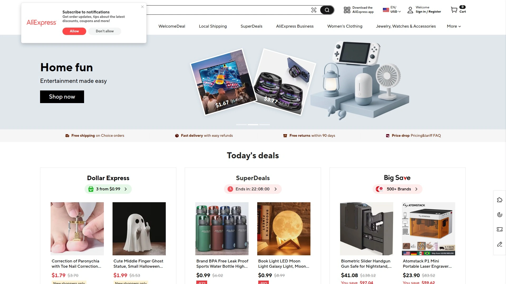

AliExpress remains the default starting point for dropshippers because the sheer product variety is impossible to match—millions of items across every conceivable category at prices enabling healthy margins even after significant markups. The platform connects you directly to Chinese manufacturers and wholesalers, cutting out middlemen and delivering the lowest possible wholesale costs. This pricing advantage lets you test products with minimal financial risk.

Buyer protection guarantees you receive items as described or get refunds, providing some security when dealing with unfamiliar suppliers. The rating and review system helps identify reliable suppliers by showing order volumes, dispute rates, and customer feedback. Communication tools built into the platform enable direct messaging with suppliers for questions, custom requests, or order modifications.

The tradeoff for low prices comes in shipping times—standard AliExpress shipping takes 15-30 days for US deliveries, and sometimes longer during peak seasons. This delay frustrates customers accustomed to Amazon Prime speeds and generates support tickets asking about order status. Product quality varies wildly depending on supplier—some deliver surprisingly good items while others ship junk requiring refunds.

Manual product importing means copying listings, editing descriptions, uploading images, and setting prices individually rather than automated bulk imports. This tedious process eats time but keeps the platform free to use. For beginners testing dropshipping viability without upfront investment or experienced sellers needing ultra-low-cost products for specific niches, AliExpress provides unmatched product selection and pricing. Pair it with tools like DSers for automation to reduce manual work.

## **[CJ Dropshipping](https://cjdropshipping.com)**

All-in-one dropshipping platform offering product sourcing, warehousing across 50+ global locations, and fulfillment with print-on-demand capabilities.

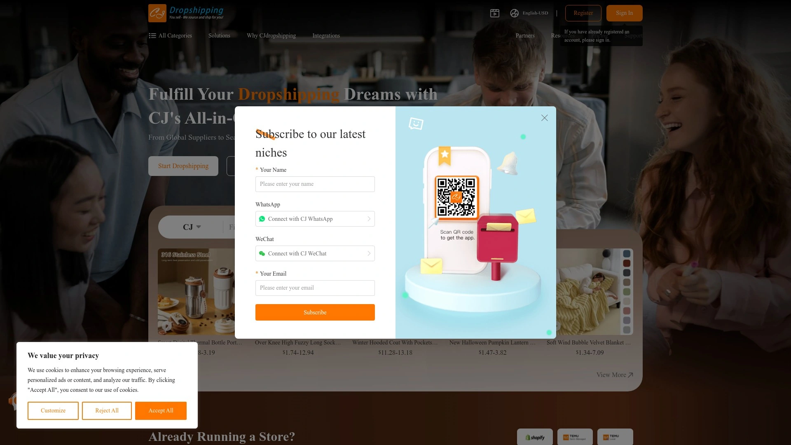

CJ Dropshipping operates as your sourcing agent, fulfillment center, and logistics coordinator rolled into one platform. When you can't find products elsewhere or need custom sourcing, CJ's team sources items from manufacturers and adds them to your store. This sourcing service fills gaps when trending products haven't reached standard dropshipping catalogs yet.

The platform's network of 50+ warehouses spanning the US, Europe, China, and Southeast Asia enables remarkably fast delivery—orders shipping from US warehouses reach customers in 2-7 days domestically. This global distribution means you're not locked into slow China shipping for every order. Inventory stored in local warehouses ships faster and costs less than international shipping.

Print-on-demand integration lets you sell custom-designed t-shirts, hoodies, mugs, and phone cases without inventory investment. Upload designs, sync products to your store, and CJ handles printing and shipping as orders arrive. Quality inspection services check products before shipping to catch defective items that would otherwise reach customers and generate returns.

The free plan enables browsing and testing without payment, while paid plans unlock faster shipping options, better pricing, and dedicated support. Integration works with Shopify, WooCommerce, and other major platforms. For dropshippers wanting one platform handling sourcing, storage, and shipping globally with print-on-demand options mixed in, CJ delivers comprehensive capabilities.

## **[Zendrop](https://zendrop.com)**

High-margin dropshipping platform featuring AI-built stores, curated winning products, and US-based fulfillment for reliable fast shipping.

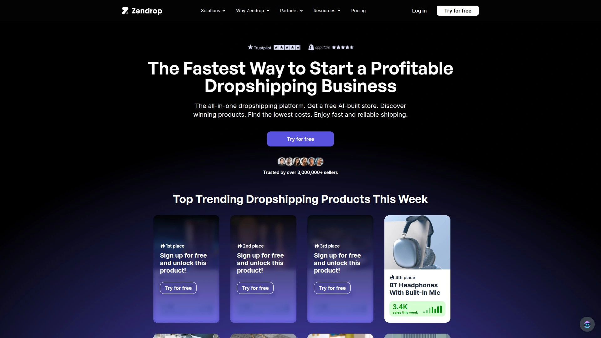

Zendrop positions itself as the all-in-one solution for launching dropshipping stores quickly through AI-powered store building and curated product selection. The platform's AI tools generate complete store designs, product descriptions, and even suggest profitable product combinations based on current trends. This automated approach helps beginners skip the paralysis of staring at blank Shopify themes.

US-based fulfillment centers enable 2-5 day domestic shipping, matching customer expectations set by Amazon. Fast delivery reduces cart abandonment during checkout when customers see realistic delivery estimates. The curated product catalog focuses on tested items with proven sales history rather than overwhelming you with millions of random options requiring extensive testing.

Automated order fulfillment processes orders without manual intervention—sales in your store trigger automatic order placement with Zendrop suppliers who ship directly to customers. Inventory syncing prevents selling out-of-stock items. Custom branding options allow branded packaging and invoices maintaining your store's identity rather than generic supplier packaging.

The platform emphasizes higher-margin products rather than competing on razor-thin margins typical of ultra-cheap Chinese goods. This focus on profitability over volume suits sellers wanting sustainable businesses rather than race-to-the-bottom pricing wars. For beginners wanting guided product selection and automated operations or established sellers seeking US fulfillment without AliExpress delays, Zendrop streamlines the entire workflow.

## **[DSers](https://dsers.com)**

Official AliExpress dropshipping solution offering bulk order processing, product bundling, and multi-store management through one dashboard.

DSers emerged as AliExpress's official tool replacing the discontinued Oberlo, inheriting that platform's user base and adding improvements. The platform's core strength lies in automation—bulk order processing handles hundreds of orders simultaneously instead of tedious individual fulfillment. This batch processing saves hours daily for high-volume stores.

Product bundling lets you create package deals combining multiple items, a feature missing from basic AliExpress integration. Bundle pricing and automated order splitting enable upselling strategies increasing average order values. Mapping tools connect supplier variants to your store's product options, maintaining consistency across listings.

The free plan provides essential functionality for stores starting out, while paid tiers unlock additional features as volume grows. Integration works exclusively with Shopify, WooCommerce, and Wix—if you're on other platforms, you'll need different tools. PayPal integration generates tracking numbers automatically, enabling seamless tracking uploads to payment processors.

DSers serves AliExpress dropshippers specifically—it doesn't source from other suppliers. For stores built entirely on AliExpress products wanting the smoothest possible workflow, DSers delivers official integration and reliable functionality. The free tier makes it accessible for testing without financial commitment.

## **[Printful](https://printful.com)**

Print-on-demand fulfillment service handling printing, packaging, and shipping for custom-designed apparel, accessories, and home goods.

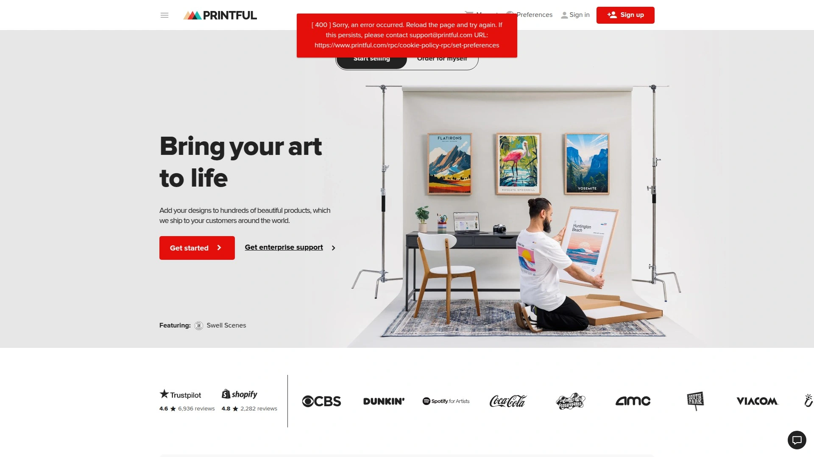

Printful pioneered quality print-on-demand by focusing exclusively on custom printing rather than trying to be everything to everyone. The platform prints and ships over 32 million custom items annually from its network of 8+ fulfillment centers worldwide. This specialization means printing quality consistently exceeds generic POD services tacking on printing as an afterthought.

Product catalog spans apparel including t-shirts, hoodies, leggings, plus accessories like hats, bags, phone cases, home goods like pillows and blankets, and even jewelry. Multiple printing methods including direct-to-garment, embroidery, sublimation, and engraving enable various creative executions. Integration with major e-commerce platforms makes setup straightforward—connect your store, upload designs, set pricing, and Printful handles everything post-sale.

Production times range from 2-7 business days depending on product complexity and season, with shipping adding another 2-5 days domestically. This complete turnaround beats ordering blanks, printing locally, and shipping yourself both in time and cost at low volumes. No minimum orders mean you can test designs with single-piece fulfillment.

Pricing runs higher than ordering blanks and printing yourself, but the trade-off comes in zero inventory risk, no equipment investment, and complete automation. Mockup generators create product images from your designs without photographing physical samples. For creators, brands, and stores focusing on custom designs where quality matters more than rock-bottom pricing, Printful delivers reliable production and fulfillment.

## **[Printify](https://printify.com)**

Print-on-demand network connecting to multiple printing partners enabling price comparison and faster production through distributed fulfillment.

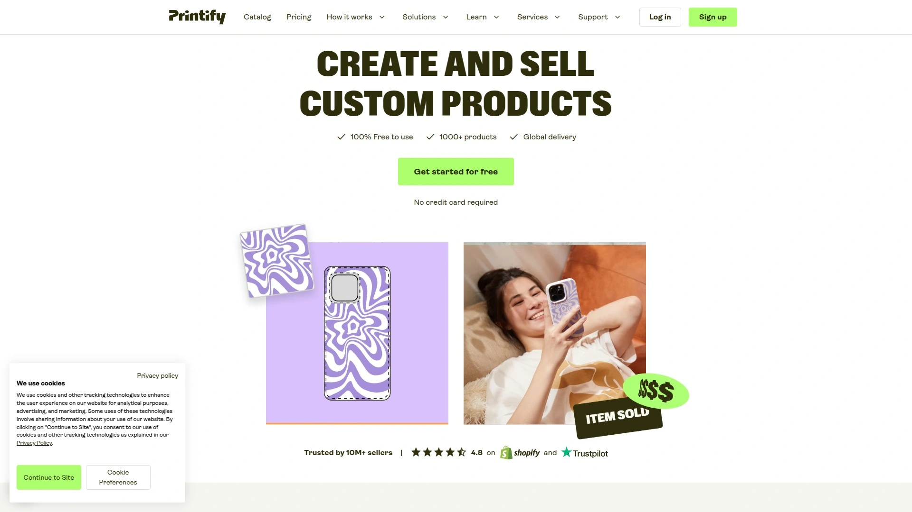

Printify operates differently from Printful by functioning as a network connecting you to numerous independent printing partners rather than running its own facilities. This marketplace model enables price comparison—the same t-shirt design might cost $8 from one partner and $12 from another, letting you optimize margins by choosing the best pricing per product.

The multi-partner approach also increases production capacity and reduces fulfillment bottlenecks. When one printer experiences delays, orders can route to alternatives. Geographic distribution of partners enables faster local shipping—US orders print in the US, European orders print in Europe, reducing international shipping times and costs.

Product variety includes standard POD items like apparel and accessories plus unique options some partners specialize in. Mockup generation, design tools, and platform integrations work similarly to Printful. The Premium plan at $29 monthly provides 20% discounts across all products, often paying for itself within a few sales for active stores.

Quality varies by printing partner since Printify doesn't control facilities directly. Reviews and ratings help identify reliable partners, but expect some learning curve testing different printers. The pricing flexibility and partner competition often yield lower costs than Printful, though production consistency may suffer. For POD sellers prioritizing price optimization and willing to test multiple partners, Printify's marketplace approach delivers savings.

## **[SaleHoo](https://salehoo.com)**

Verified supplier directory connecting retailers to 8,000+ vetted wholesalers and dropshippers with market research tools included.

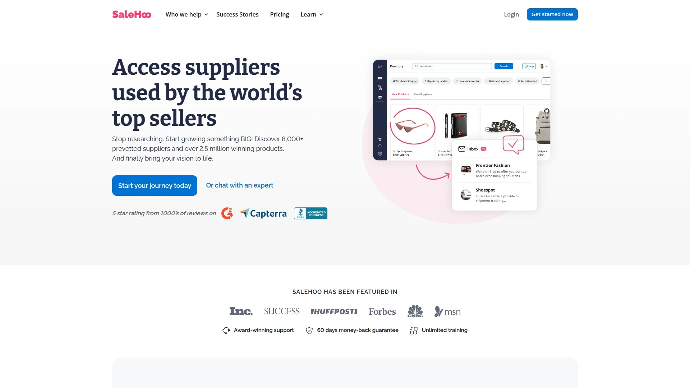

SaleHoo functions as a directory rather than direct integration platform—you find suppliers through their database, then contact suppliers directly to establish relationships. This directory approach differs from platforms where products sync automatically to your store. Over 8,000 suppliers span 75 product categories covering virtually every niche.

The verification process distinguishes SaleHoo from random Google searching—each supplier undergoes screening before directory inclusion, reducing scam risk. Directory listings show supplier location, product range, minimum orders, and whether they offer dropshipping, wholesale, or private labeling. This transparency helps you evaluate fit before making contact.

Market Research Labs provide data-driven insights showing whether products sell profitably on eBay, Amazon, and other platforms. Historical sales data, competition analysis, and pricing trends inform product selection rather than guessing what might work. This research tool alone justifies the directory subscription for serious sellers.

The supplier guarantee protects against defects and scams. Educational content including courses and community forums teach dropshipping fundamentals. Pricing runs subscription-based with annual plans providing best value. For sellers wanting vetted supplier access with research tools guiding product selection, SaleHoo delivers curated connections and intelligence that free supplier hunting can't match.

## **[Syncee](https://syncee.com)**

Global supplier network connecting retailers to 12,000+ brands across US, Europe, Canada, and Australia with wholesale and dropshipping options.

Syncee connects you to suppliers offering both dropshipping and wholesale arrangements, enabling evolution from inventory-free dropshipping to bulk purchasing as your business grows. This flexibility lets you test products via dropshipping, then transition successful items to wholesale for better margins without switching suppliers.

The international supplier network spans major markets including US, Europe, Canada, and Australia. Local supplier sourcing enables regional targeting—sell in the UK using UK suppliers for fast domestic shipping rather than international waits. The platform supports global expansion without managing separate supplier relationships per region.

Real-time inventory and pricing synchronization prevents stock-out issues and pricing mismatches. Automated order forwarding sends purchase details to suppliers who handle fulfillment. 24/7 customer support assists with setup, supplier communication, and platform issues—a significant advantage for users needing help outside business hours.

The free plan allows importing up to 25 products for testing. Paid tiers unlock unlimited products and advanced features. For sellers targeting international markets or wanting the option to graduate from dropshipping to wholesale with the same suppliers, Syncee provides network breadth and model flexibility.

## **[DropCommerce](https://dropcommerce.com)**

North American supplier network specializing in US and Canadian brands with minimum 30% retailer margins and branded packaging.

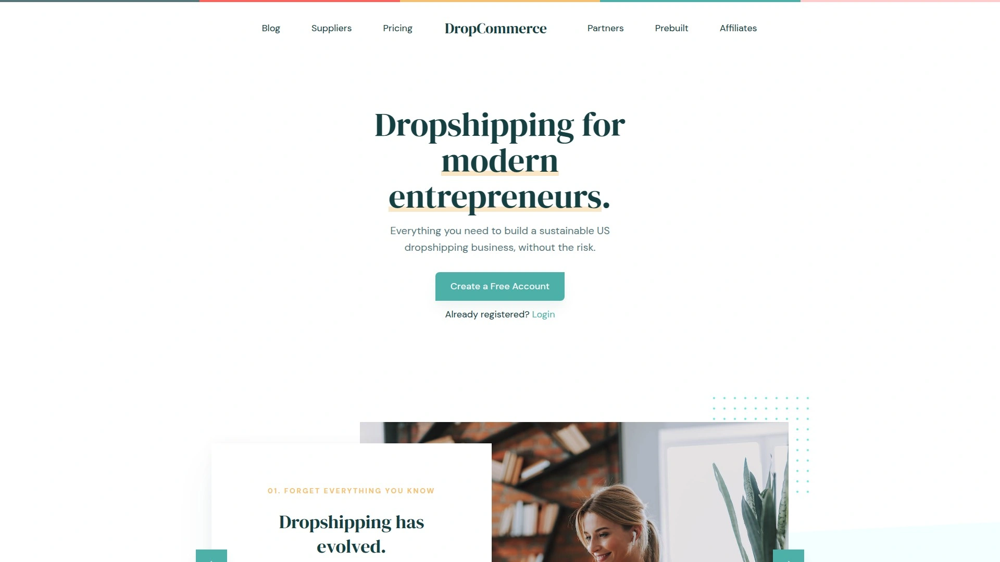

DropCommerce curates suppliers exclusively from the United States and Canada, guaranteeing 3-5 day shipping for North American customers. This geographic focus eliminates international shipping delays while supporting domestic manufacturers and brands. Every product listing includes delivery time and shipping destination information upfront.

The 30% minimum retailer margin requirement ensures products offer profitable markup potential. Unlike platforms where you calculate margins yourself, DropCommerce pre-qualifies products for acceptable profitability. This curation saves time testing products that barely break even after accounting for advertising costs.

Branded invoicing and packaging options let you maintain brand identity through the customer experience. Products ship in your branding rather than supplier packaging, reinforcing your store's professional image. Real brands populate the catalog rather than generic white-label items, providing authenticity customers appreciate.

The free plan allows importing 25 products, sufficient for niche stores testing initial product selection. The 14-day premium trial enables exploring full functionality before subscribing. For stores specifically targeting US and Canadian customers where fast domestic shipping and brand authenticity matter, DropCommerce delivers curated quality and geography-appropriate fulfillment.

## **[Modalyst](https://modalyst.co)**

Curated marketplace connecting retailers to independent brands and designers with focus on unique products and US suppliers.

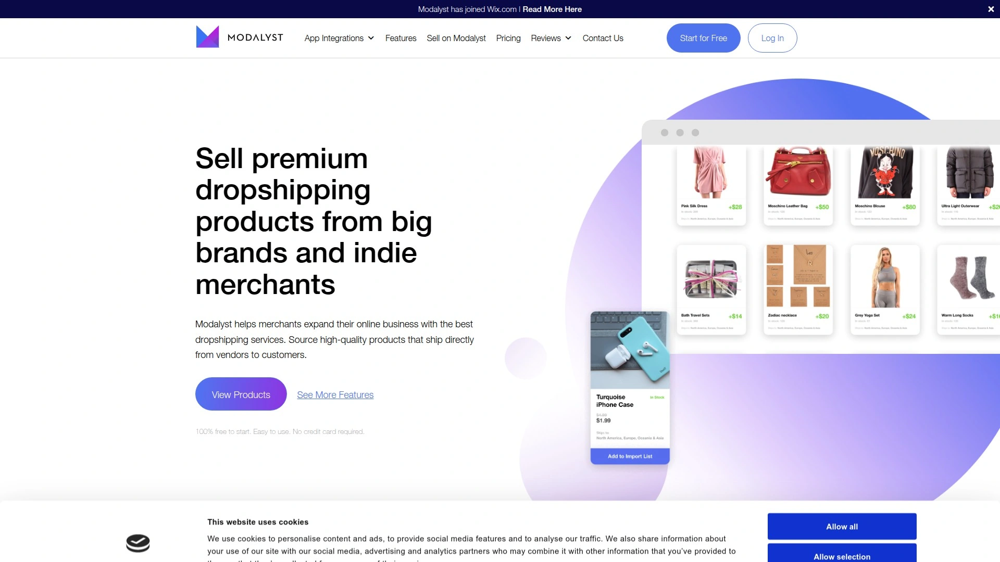

Modalyst emphasizes independent brands and unique products rather than generic items available from hundreds of competitors. This curation helps stores differentiate through product selection instead of competing purely on price for commodity goods everyone sells. US-based suppliers feature prominently, enabling fast domestic shipping.

The platform also integrates with AliExpress, giving you access to both premium independent brands and affordable mass-market items through one interface. This hybrid approach lets you mix unique hero products with affordable complementary items. Automated inventory syncing and order routing work across both supplier types.

Integration with major e-commerce platforms including Shopify, WooCommerce, and BigCommerce provides flexible setup options. Multi-channel selling tools enable listing products on multiple storefronts while managing everything through Modalyst's dashboard. The free plan provides access to basic features for testing viability.

The focus on independent brands means product costs typically run higher than pure China-sourcing. This premium positioning suits stores targeting quality-conscious customers over bargain hunters. For retailers wanting to stand out through unique product assortment combining independent designers with affordable basics, Modalyst's curated marketplace delivers differentiation.

## **[AutoDS](https://autods.com)**

Automated dropshipping platform supporting multiple marketplaces including Amazon, eBay, Walmart, and Shopify with extensive supplier integration.

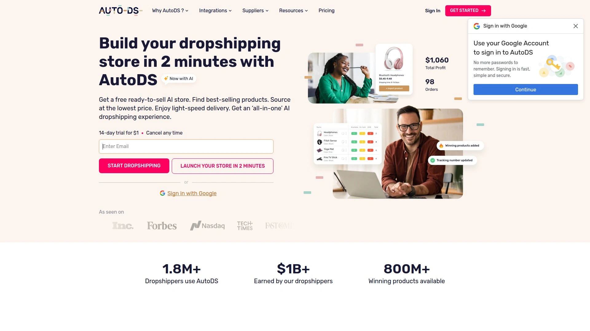

AutoDS distinguishes itself through multi-marketplace support—manage Amazon, eBay, Walmart, Shopify, WooCommerce, and Facebook Marketplace dropshipping through one dashboard. This breadth lets you diversify across platforms rather than putting all eggs in one Shopify basket. Each marketplace operates differently, and AutoDS handles the specific requirements per platform.

Automation extends beyond basic order fulfillment into price optimization, inventory monitoring across multiple suppliers, and automatic sourcing finding the best pricing for each product. If your current supplier raises prices or goes out of stock, AutoDS can automatically switch to alternative suppliers maintaining availability.

The platform supports dropshipping from Amazon, Walmart, Costco, Target, Home Depot, Wayfair, and many other retailers as sources. This arbitrage approach differs from traditional manufacturer dropshipping—you're essentially reselling from retail sources. Fast shipping from major retailers often beats overseas suppliers.

Finding products already selling well on one platform and listing them on another reduces guessing about demand. Repricing tools adjust your prices automatically in response to supplier changes or competitor pricing. For multi-platform sellers or those pursuing retail arbitrage models, AutoDS consolidates management across marketplaces that normally require separate tools.

## **[Wholesale2B](https://wholesale2b.com)**

Extensive supplier network aggregating 100+ US-based dropshippers with 2+ million products and one-click store integration.

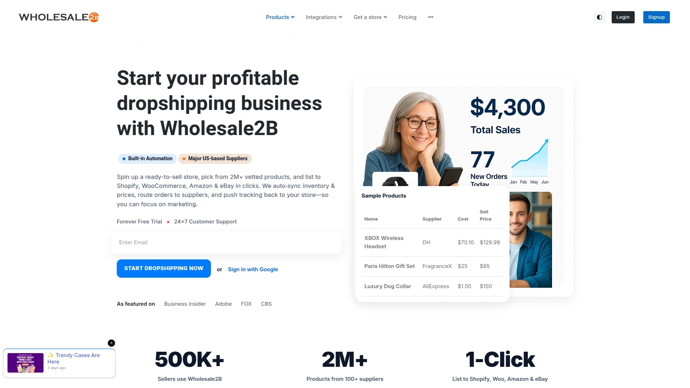

Wholesale2B provides access to millions of products from over 100 verified US suppliers through unified integration. This aggregation eliminates negotiating separate agreements with individual suppliers—one Wholesale2B account grants access to the entire network. Product categories span electronics, fashion, home goods, pet supplies, and virtually every retail category.

Real-time inventory synchronization across all suppliers prevents stock-out issues without manually checking availability. When suppliers update inventory or pricing, changes propagate automatically to your listings. Automated order routing sends purchases to appropriate suppliers based on product source.

One-click integration with Shopify, WooCommerce, Amazon, and eBay enables rapid store setup. You can even launch ready-to-sell stores pre-loaded with products. Bulk product importing adds thousands of items to your catalog in minutes rather than individual listing creation.

The supplier network includes major names like BangGood, ElectroFlip, and numerous specialized suppliers. US-based fulfillment ensures faster shipping than overseas alternatives. Pricing varies by plan with higher tiers unlocking more products and features. For sellers wanting maximum product variety from US suppliers through simplified integration, Wholesale2B delivers scale and automation.

## **[Doba](https://doba.com)**

Comprehensive dropshipping directory with 2+ million products, automated order processing, and custom data export for bulk management.

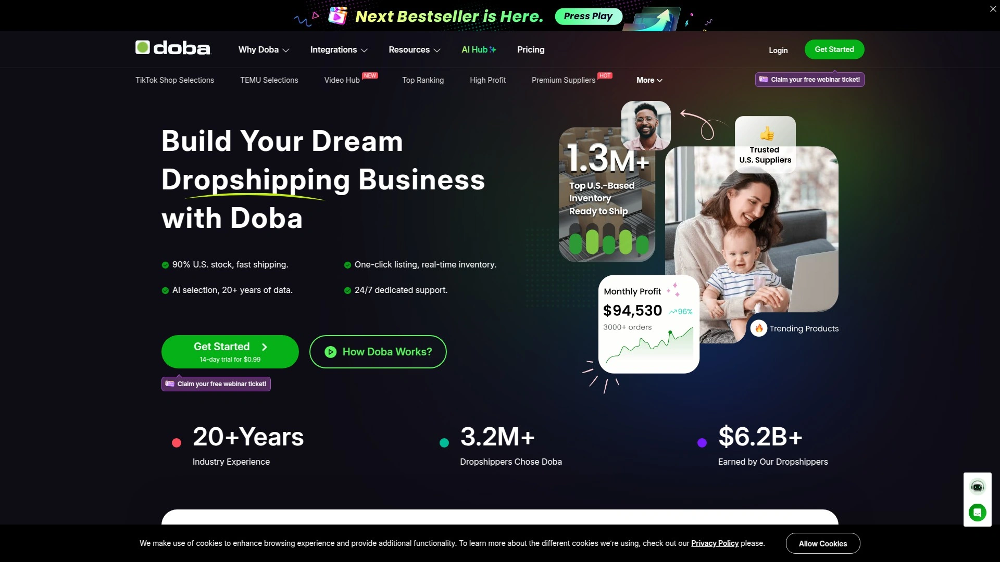

Doba handles supplier communication and logistics coordination on your behalf—once you make a sale, Doba contacts suppliers and ensures delivery without you managing those relationships directly. This intermediary role simplifies multi-supplier management when your store sources from dozens of different suppliers.

The product directory includes over 2 million items across all major categories from suppliers based in the United States and China. Catalog diversity enables general stores carrying wide product ranges or niche stores finding specialized items. Search and filtering tools help narrow millions of options to relevant products for your niche.

Automation services and custom data export tools facilitate managing large product catalogs. Bulk data manipulation lets you adjust pricing across thousands of SKUs, update descriptions, or modify inventory levels efficiently. This scalability suits established stores outgrowing manual product management.

Domestic US orders typically deliver in 3-8 business days while international orders take 7-21 days. Pricing tiers range from $24.99 for startups to $299.99 for enterprise accounts. The comprehensive approach combining directory, automation, and order management appeals to busy entrepreneurs wanting hands-off operations. For sellers prioritizing simplified multi-supplier management over direct control, Doba's intermediary model removes operational friction.

## **[Worldwide Brands](https://worldwidebrands.com)**

Certified wholesale and dropship directory featuring legitimate manufacturers and distributors with one-time lifetime membership fee.

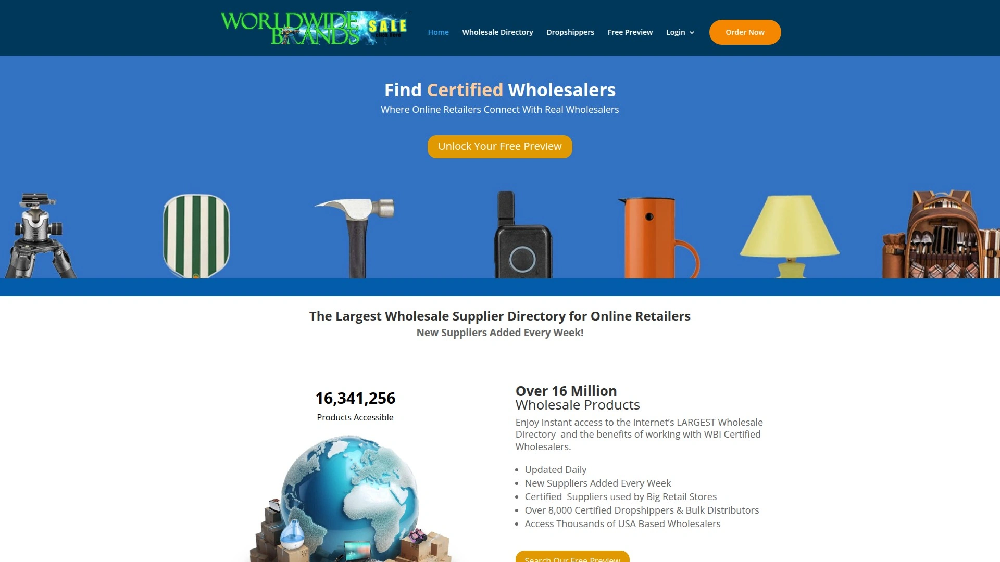

Worldwide Brands pioneered verified supplier directories by certifying manufacturers and authorized distributors rather than allowing any company to list. This certification ensures you're dealing with legitimate businesses rather than scam operations common in unvetted directories. The directory includes suppliers across numerous product categories.

The one-time lifetime membership fee differs from recurring subscriptions—pay once for permanent access. For long-term sellers, this pricing model costs less than annual subscriptions compounding over years. The upfront investment filters out casual browsers, maintaining a directory used by serious retailers.

Supplier listings provide detailed information including product ranges, minimum orders, dropshipping capabilities, and contact information. Unlike automated integration platforms, you establish direct relationships with suppliers through their contact details. This direct access enables negotiating better terms, requesting custom products, and building genuine business relationships.

The directory approach requires more manual work than automated platforms—you contact suppliers, negotiate terms, manually process orders. This hands-on involvement suits sellers wanting control and direct supplier relationships over complete automation. For established businesses seeking legitimate wholesale sources and willing to invest time in supplier relationships, Worldwide Brands' certified directory delivers vetted access.

## **[Megagoods](https://megagoods.com)**

US-based distributor specializing in electronics, home goods, and personal care with dropshipping services and 30-day return guarantee.

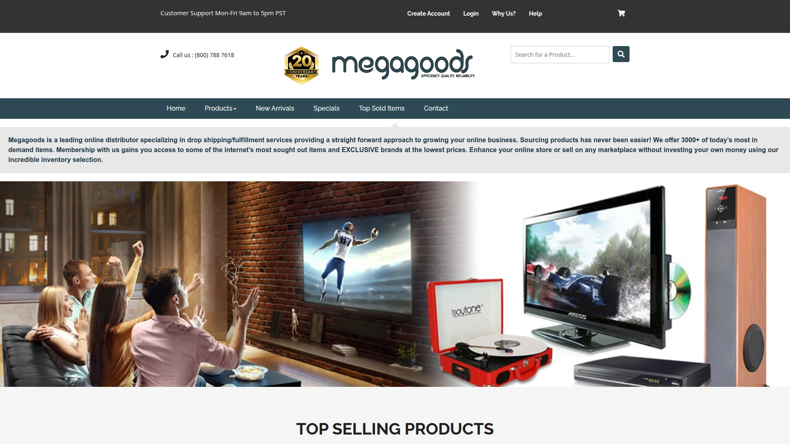

Megagoods operates as a direct distributor offering dropshipping services across a focused product catalog of over 3,000 items. The inventory emphasizes electronics, home and garden products, kitchen appliances, personal care items, and gaming accessories. This concentration in specific categories means deeper selection within those niches than general marketplaces spreading thin across all categories.

Quality commitment includes 30-day return guarantees against manufacturer defects, providing recourse when products arrive damaged or defective. This warranty protection exceeds many overseas suppliers offering little to no return accommodation. The US-based operation enables faster customer service resolution compared to international time zones and language barriers.

Integration through platforms like Wholesale2B provides automated product importing and order processing. You don't need direct reseller accounts with Megagoods—access occurs through intermediary platforms handling the technical integration. This simplified access removes barriers to working with specialized distributors.

Product pricing reflects US distribution rather than direct-from-manufacturer costs, positioning Megagoods in the mid-range price tier. For stores focusing on electronics and home goods categories where supplier specialization and return policies matter, Megagoods delivers category depth and reliability.

## **[Trendsi](https://trendsi.com)**

Fashion-focused dropshipping platform providing on-trend apparel from curated suppliers with 2-5 day US shipping and branded packaging.

Trendsi specializes exclusively in fashion dropshipping, curating trendy clothing, accessories, and apparel from verified suppliers. This vertical focus means the team understands fashion retail's specific requirements—seasonal trends, sizing consistency, style relevance—better than general dropshipping platforms treating fashion as just another category.

Real-time inventory synchronization prevents overselling sizes or styles that just went out of stock. Automated order fulfillment routes purchases to suppliers who ship directly to customers in 2-5 business days for US orders. Branded packaging maintains your boutique's identity rather than generic supplier boxes revealing the dropshipping model.

The platform offers three sourcing options: traditional dropshipping for testing, "open pack wholesale" allowing small quantity purchases at lower per-unit costs, and made-to-order manufacturing for custom clothing lines. This progression lets you start risk-free with dropshipping, then graduate to wholesale for bestsellers, and eventually launch custom designs.

Integration works with Shopify, CommentSold for live selling on Facebook and Instagram, TikTok Shop, and Poshmark. The free plan provides access to browse products and test integration before committing. For fashion boutiques, influencers selling apparel, and online stores focusing on clothing where style curation and US shipping matter, Trendsi's vertical specialization delivers relevant functionality.

## **[Collective](https://apps.shopify.com/collective)**

Shopify's native supplier network connecting stores to established brands with free usage and potential margins ranging 20-50%.

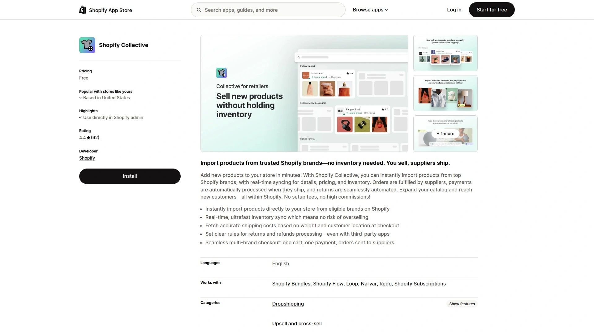

Collective operates as Shopify's official supplier network, providing seamless integration that other platforms can't match. The native Shopify connection means product imports, order routing, and inventory syncing work flawlessly without third-party integration issues. Shipping rate calculation occurs automatically at checkout using suppliers' actual shipping terms.

The supplier network consists of established Shopify brands rather than anonymous manufacturers. This brand focus means you're selling recognized products with existing customer trust. Supplier profiles include verified reviews from other retailers, transparency about fulfillment performance, and clear terms.

Product recommendations based on your store's existing bestsellers suggest complementary items likely to resonate with your customer base. This personalization beats browsing massive catalogs hoping to stumble on good fits. Margins typically range from 20-50% depending on supplier and product category, clearly displayed upfront.

The platform is completely free for Shopify users, though eligibility requirements apply and some features limit to specific regions. No monthly fees, no hidden charges—just connect your store and start adding products. For existing Shopify merchants wanting to add dropshipping from trusted brands without juggling external platforms, Collective delivers native integration and quality products.

## **[AI Dropship](https://apps.shopify.com/ai-dropship)**

AI-powered product research and sourcing platform identifying winning products and automating supplier connections for Shopify stores.

AI Dropship leverages artificial intelligence to analyze market trends, identify high-potential products, and automate sourcing processes. The AI analyzes millions of data points including sales patterns, search trends, and social media signals to predict which products will perform well. This data-driven approach beats guessing or copying what competitors sell.

Automated supplier connections mean once the AI identifies promising products, it sources them from appropriate suppliers and prepares them for import to your store. Product listings generate with optimized descriptions, pricing recommendations, and image selections rather than manual creation. This automation accelerates store setup from weeks to days.

Integration with Shopify enables one-click product importing with all details pre-filled. Inventory and pricing update automatically as supplier information changes. The platform monitors product performance and suggests optimization based on sales data.

The AI-powered approach particularly suits beginners overwhelmed by product selection paralysis—instead of analyzing thousands of potential items manually, let algorithms identify statistically probable winners. For data-driven sellers trusting algorithmic recommendations over gut feelings, AI Dropship combines research, sourcing, and optimization into one tool.

## **[Wholesale Central](https://wholesalecentral.com)**

Free wholesale directory aggregating manufacturers, importers, and closeout liquidators across diverse product categories.

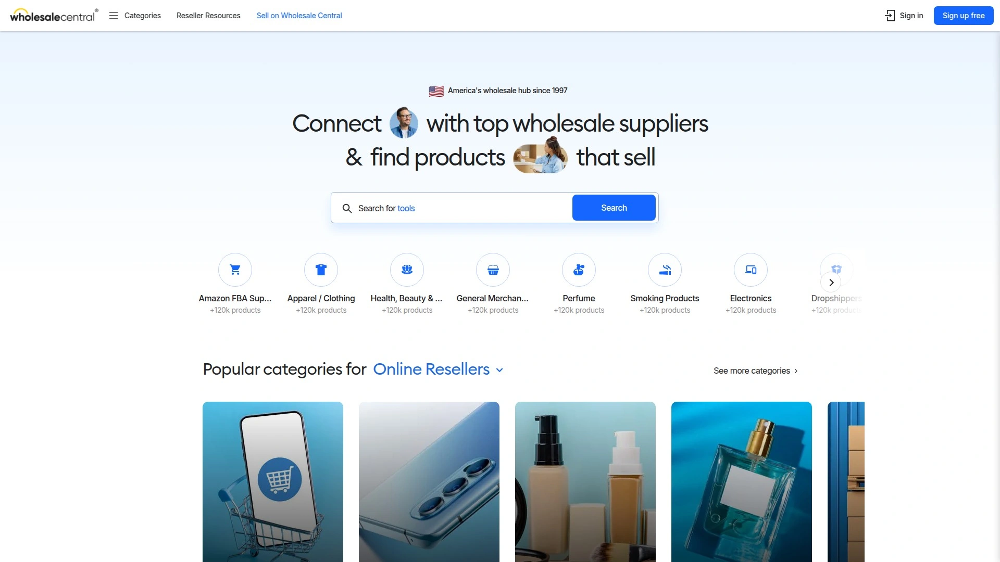

Wholesale Central operates as a completely free directory listing thousands of wholesale suppliers across virtually every product category imaginable. The zero-cost access removes barriers for sellers testing supplier connections without subscription commitments. Supplier listings provide company information, product categories, and contact details for direct outreach.

The directory includes manufacturers, importers, distributors, and liquidators offering products at various price points. Liquidation and closeout sections provide deeply discounted merchandise for bargain-focused sellers. Category browsing enables niche-specific supplier discovery rather than wading through irrelevant listings.

Unlike automated integration platforms, Wholesale Central functions purely as directory—you find suppliers, contact them directly, negotiate terms, and manage relationships manually. This hands-on approach requires more work but enables personalized partnerships and potentially better terms through direct negotiation.

The free model means less vetting than paid directories—you're responsible for verifying supplier legitimacy and quality. Research suppliers thoroughly before committing to orders or sharing payment information. For bootstrap sellers wanting maximum supplier options at zero cost and willing to invest time in direct relationship building, Wholesale Central delivers comprehensive free access.

## **[Alibaba](https://alibaba.com)**

B2B wholesale marketplace connecting retailers to manufacturers for bulk purchasing, custom manufacturing, and increasingly, dropshipping services.

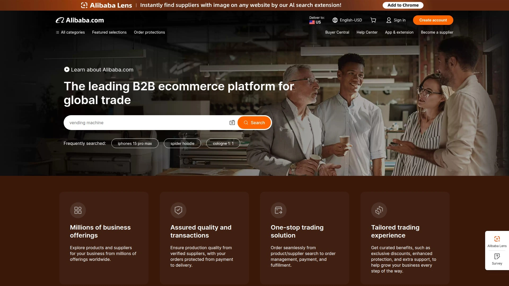

Alibaba differs from AliExpress by focusing on B2B wholesale rather than small retail orders—typical minimum order quantities run in the hundreds or thousands of units. This volume orientation suits established businesses ready to order inventory rather than testing individual products. Wholesale pricing beats retail-focused platforms when buying at scale.

Custom manufacturing capabilities enable private labeling and product customization unavailable through standard dropshipping. Work directly with factories to modify existing products or develop entirely custom items. This customization creates unique inventory differentiated from competitors selling identical dropshipped items.

The dropshipping services Alibaba now offers bridge the gap between wholesale purchasing and inventory-free retail. Select suppliers provide dropshipping arrangements where they fulfill individual orders despite the platform's wholesale heritage. These arrangements typically require negotiation rather than automatic setup.

Quality and supplier reliability vary dramatically—thorough vetting, sample ordering, and careful contract negotiation protect against scams and defective inventory. Payment protection programs provide some recourse but don't eliminate all risk. For businesses ready to graduate from pure dropshipping to custom product development and bulk purchasing, Alibaba's manufacturing access enables product differentiation and margin expansion.

## **[TopDawg](https://topdawg.com)**

US-focused dropshipping platform connecting retailers to 500,000+ products from American suppliers with fast shipping and premium support.

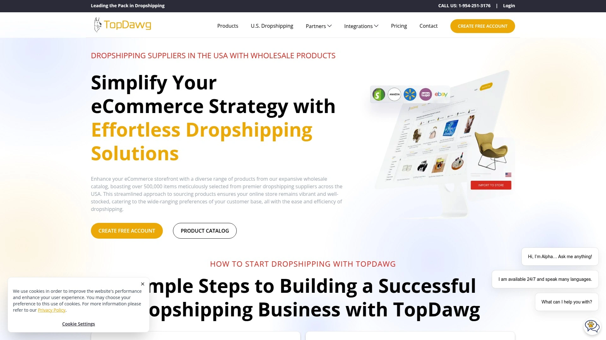

TopDawg exclusively sources from United States-based suppliers, guaranteeing domestic fulfillment and fast delivery without international shipping uncertainties. The 500,000+ product catalog spans pet supplies, home decor, fashion accessories, electronics, and numerous categories from verified US suppliers.

Simple product import workflow lets you browse the catalog, select items, and sync them directly to your Shopify store with one-click integration. Orders automatically receive carrier tracking within one business day, enabling quick tracking uploads and customer notifications. Automated order information syncing keeps everything current without manual updates.

Carrier calculated shipping support provides accurate shipping costs at checkout based on customer location and actual carrier rates. This precision beats estimated shipping preventing surprise losses when actual costs exceed estimates. The platform supports automated order processing and information synchronization reducing manual intervention.

Premium support via phone, email, and chat comes standard across all plan tiers. The free Start-Up plan lets you explore the platform, browse products, view wholesale pricing, and test integrations before committing to paid plans. For US-focused stores prioritizing domestic suppliers and wanting responsive support, TopDawg delivers exclusively American inventory with reliable fulfillment.

## **[Dropified](https://dropified.com)**

Multi-channel dropshipping automation tool supporting eBay, Amazon, Shopify, and more with advanced product importing and order fulfillment.

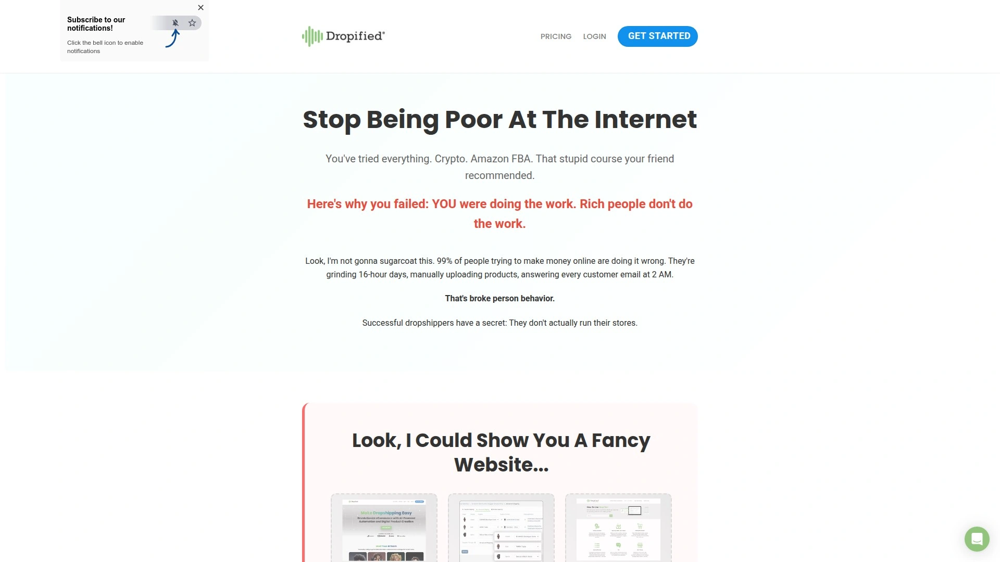

Dropified functions as automation software rather than supplier directory—it connects to various sources including AliExpress, Amazon, and others, then automates product importing and order fulfillment across multiple selling channels. This tool-based approach works with suppliers you already use rather than locking you into specific supplier networks.

Multi-channel support includes Shopify, WooCommerce, eBay, Amazon, CommerceHQ, and Groovesell enabling management from one dashboard. List products once and sell across multiple platforms without separate management per channel. Automated order fulfillment routes purchases to appropriate suppliers regardless of which storefront generated the sale.

Advanced features include automated price monitoring adjusting your prices when supplier costs change, inventory monitoring preventing stock-out sales, and bulk editing handling pricing updates across thousands of products simultaneously. The Chrome extension enables quick product imports while browsing supplier sites.

Pricing runs subscription-based with tiers scaling by features and order volume. Integration setup requires more technical knowledge than beginner-focused platforms. For established sellers managing substantial product catalogs across multiple channels who need powerful automation tools, Dropified delivers software capabilities beyond what simple integration apps provide.

## FAQ

**What's the real difference between dropshipping from US suppliers versus China?**

US and EU suppliers deliver products in 2-5 days versus 15-30 days from China, dramatically reducing refund requests from impatient customers and improving reviews. However, Chinese suppliers often charge 30-50% less than Western equivalents, enabling higher margins or more competitive pricing. The trade-off comes down to whether your customers prioritize speed over savings—premium brands justify US fulfillment, while budget stores might accept longer shipping for better margins. Testing both approaches for different product categories often works best rather than choosing one exclusively.

**Do I need to pay monthly fees to multiple dropshipping platforms or can I use free plans?**

Free plans from DSers, Spocket, Syncee, and others let you test with limited product imports (typically 10-25 items), sufficient for validating concepts before committing to paid tiers. However, serious stores quickly outgrow free limits once product count exceeds a few dozen items. Most sellers eventually subscribe to 1-3 platforms rather than attempting to manage everything free—mixing a premium platform for US products with DSers for AliExpress items provides speed and affordability without excessive subscription costs. Calculate whether subscription fees get recovered through better conversion rates and lower refunds.

**How do I avoid selling the same products as thousands of other dropshippers?**

Source from platforms emphasizing unique suppliers like Modalyst's independent brands or Printful's custom print-on-demand where your designs create differentiation. Alternatively, use general suppliers but create unique product bundles, enhanced product photography, and detailed descriptions that competitors using auto-generated listings can't match. The combination of sourcing strategy and presentation determines whether you blend into commodity competition or stand out—product uniqueness matters less than how you position and present items.

## Wrapping Up

Choosing among 22 dropshipping platforms depends entirely on your specific situation—product niche, target market location, whether you prioritize absolute lowest cost or fastest shipping, and how much automation versus hands-on control you want. **[Spocket](https://spocket.co)** hits the sweet spot for most Shopify and WooCommerce stores targeting US and European customers by connecting you to quality domestic suppliers delivering in 2-5 days instead of the month-long waits killing customer satisfaction, all while automated inventory syncing prevents stock-out nightmares and branded invoicing maintains your store's professional identity from first click to doorstep delivery.
